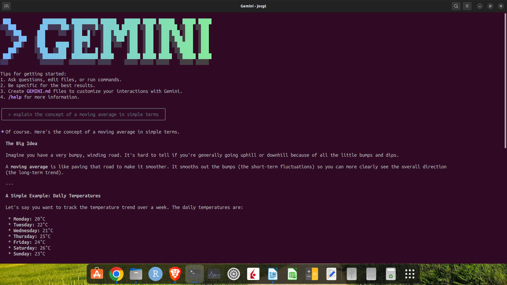
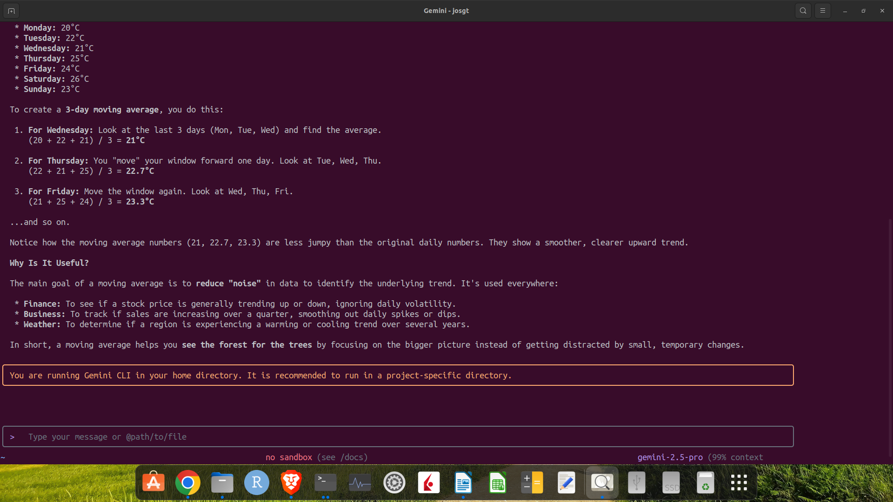
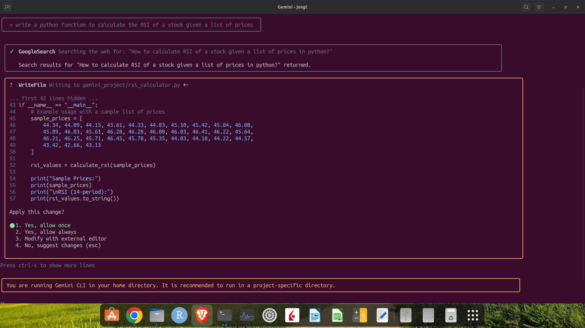
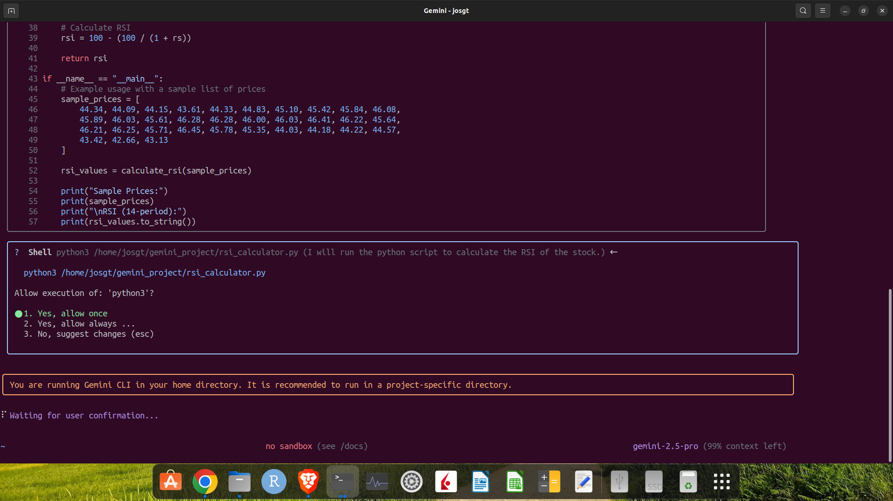
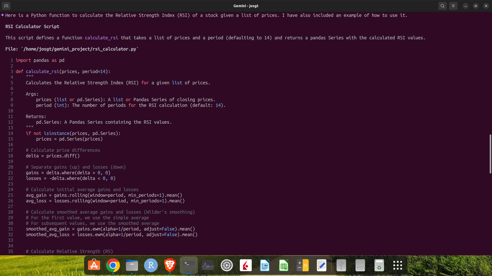

# Gemini CLI in Trading Workflows

**For Educational and Paper Trading Purposes Only**

The content, code, and strategies provided in this repository are for educational and informational purposes only. They are not intended as financial advice, investment recommendations, or a solicitation to buy or sell any securities.

**Trading financial markets involves substantial risk, and you are solely responsible for any decisions you make. The authors and contributors of this repository assume no liability for any financial losses you may incur.**

Always conduct your own thorough research and risk assessment before deploying any trading strategy in a live environment. You should start by using these examples with paper trading accounts.

---

This section demonstrates the use of Google’s Gemini models via a command-line interface (CLI) to augment trading workflows.

A CLI provides a direct method for interacting with AI models, suitable for scripting, automation, and integration into local development environments.

## Prerequisites

This guide assumes you have the Google Gemini CLI installed and authenticated. For installation and setup instructions, please refer to the official [Gemini CLI repository](https://github.com/google-gemini/gemini-cli).

### CLI Approach

* **Automation & Scripting:** Incorporate AI-powered tasks into automated scripts and workflows.

* **Efficiency:** A CLI can be a fast way for developers to perform tasks.

* **Flexibility:** A CLI approach allows for control and the ability to pipe outputs between tools.

### Available Use Cases

The following examples are available in this directory:

* [**Example 01: Create Backtesting Code for BTC-USD**](http://./example_01_create_backtesting_code/README.md): This example demonstrates using Gemini CLI to generate a Python script for backtesting a trading strategy using the BTC-USD, including parameter optimization and a PDF to report the strategy performance metrics and plots.

* [**Example 02: Run a Multi-Agent System on an IB Stock Setup**](http://./example_02_run_multi_agent_system_on_IB_stock_setup/README.md): This example demonstrates how to integrate a multi-agent system for news analysis into our existing IB-based stock trading setup.

## Usage Examples

### Example 1: Explaining a Concept

Here is a basic prompt to explain a trading concept.

```bash
gemini "explain the concept of a moving average in simple terms"
```





### Example 2: Generating a Python Script

Here is an example of generating a Python function to calculate the Relative Strength Index (RSI).

```bash
gemini "write a python function to calculate the RSI of a stock given a list of prices"
```





